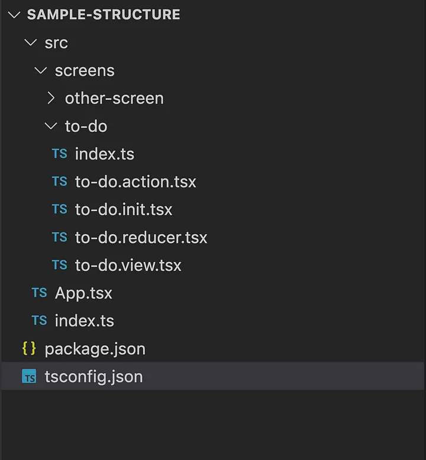

# Structure

For any application code organization and file structure are the key to success. It helps us divide the code 
base on their function. Using redux-rewire does not enforce any predefined convention to follow, but we 
try to follow the following structure for better understanding and keep code clear.
Now, before diving into creating screens/pages/components for our application.

------------------------------------------------------------------------------------------------

As shared in the screenshot below, a simple project structure with a single
screen would look something similar. We can follow the same format for generating any 
other stateful component.

#### Here there are basically three kind of files we will be focusing on:

***.init.ts**

This file we defined the initial state of the component. 
along with the type.

***.action.ts**

All the file name ending with *.action.ts consist of side effect code essentially it is making api 
calls, reading values from storage or any other activity depending on use case.

***.reducer.ts**

All the file name ending with *.action.ts consist of side effect code essentially it is making api
calls, reading values from storage or any other activity depending on use case. 

